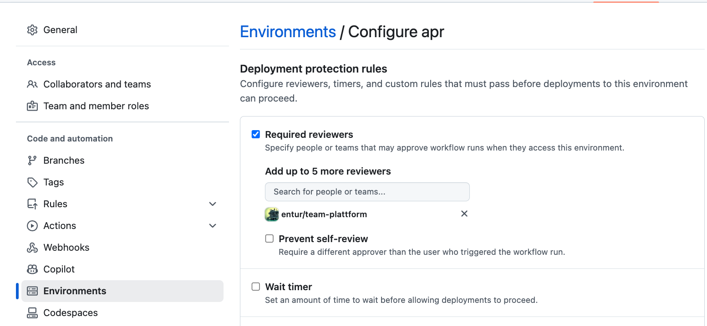

<h1 align="center">
      
      <br>entur/gha-firebase<br>
</h1>

[](https://github.com/entur/gha-firebase/actions/workflows/ci.yml)

GitHub Actions for working with Firebase in Google Cloud

- [Firebase Hosting Preview](../README-firebase-hosting-preview.md)
- [Firebase Hosting Deploy](../README-firebase-hosting-deploy.md)

## Golden Path

- `./firebase.json` at the root of your repository

### Example

Let's look at an example, assume our repo is called `amazing-app`:

```sh
λ amazing-app ❯ tree
.
├── README.md
├── firebase.json
└── .github
    └── workflows
        └── PR.yml
```

```yaml
# pr.yml
name: Build, preview and deploy
on:
  pull_request:

on:
  pull_request:

jobs:
  # buildstep not included, can be defined in .firebase.json as a predeploy step or as a job here

  # Create a preview
  firebase-preview-dev:
    needs: yarn-build
    uses: entur/gha-firebase/.github/workflows/firebase-hosting-preview.yml@v1
    with:
      gcp_project_id: my-gcp-project-dev
      environment: dev
      build_artifact_name: artifacts
      build_artifact_path: build
  # Approval step
  firebase-approve:
    needs: firebase-preview-dev
    runs-on: ubuntu-latest
    environment: apr  # a dedicated "Approval" environment
    steps:
      - name: Approve deployment
        run: echo "Approving deployment"
  # Deploy to the "live" channel
  firebase-deploy-dev:
    needs: firebase-approve
    uses: entur/gha-firebase/.github/workflows/firebase-hosting-deploy.yml@v1
    with:
      gcp_project_id: my-gcp-project-dev
      environment: dev
      build_artifact_name: artifacts
      build_artifact_path: build
```

PS: To get a stop before we deploy to production we use "Environment protection rules":
